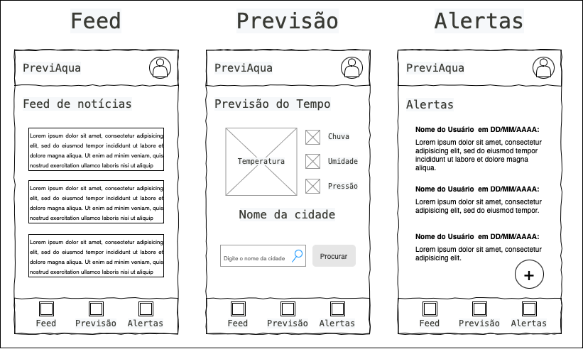

# Front-end Móvel

LINK: https://snack.expo.dev/@bernardocrs/previaqua

O PreviAqua versão mobile permite aos usuários acessar as últimas notícias climáticas, conferir a previsão do tempo da sua cidade e alertar outros usuários de eventos climáticos.

## Tecnologias Utilizadas
[Lista das tecnologias principais que serão utilizadas no projeto.]

## Arquitetura

[Descrição da arquitetura das aplicação móvel, incluindo os componentes e suas interações.]

## Modelagem da Aplicação
[Descreva a modelagem da aplicação, incluindo a estrutura de dados, diagramas de classes ou entidades, e outras representações visuais relevantes.]

## Projeto da Interface
[Descreva o projeto da interface móvel da aplicação, incluindo o design visual, layout das páginas, interações do usuário e outros aspectos relevantes.]

### Wireframes

### Design Visual
Optamos por uma interface clean, utilizando uma barra de navegação inferior com três tabs: 
- Feed: primeira página que aparece ao abrir o App. Nela constam notícias recentes sobre questões relacionadas ao clima.
- Previsão: onde o usuário pode digitar o nome da cidade e visualizar informações climáticas em tempo real.
- Alertas: local onde o usuário visualiza alertas emitidos por outros usuários da plataforma sobre enchentes, deslizamentos, alagamentos, etc. O usuário também é capaz de criar um alerta.
Escolhemos ícones facilmente identificáveis que remetem a feed de notícias (jornal), previsão do tempo (nuvem e sol), alerta (exclamação).
A paleta de cores incluem as cores azul, laranja, cinza e roxo; cores essas que remetem às condições climáticas ou estão presentes classicamente em apps de previsão do tempo.

### Layout Responsivo
[Discuta como a interface será adaptada para diferentes tamanhos de tela e dispositivos.]

### Interações do Usuário
[Descreva as interações do usuário na interface, como animações, transições entre páginas e outras interações.]

## Fluxo de Dados

1 - Abertura do Aplicativo:
   * O usuário abre o aplicativo em seu dispositivo móvel.
     
2 - Interface de Entrada de Dados:
   * O aplicativo exibe uma tela de entrada de dados solicitando que o usuário insira o estado e a cidade que deseja consultar em relação à precipitação.
     
3 - Interatividade com o Front-end:
   *   O usuário insere o estado e a cidade desejados.
   * O front-end valida os dados inseridos para garantir que correspondam a uma localização válida.
  
4 - Comunicação com o Back-end:
   * Após a validação, o front-end envia uma solicitação ao back-end contendo as informações de localização inseridas pelo usuário.
     
5 - Integração com a API do INMET:
   * O back-end faz uma chamada à API do INMET (Instituto Nacional de Meteorologia) para obter informações meteorológicas da região específica fornecida pelo usuário (estado e cidade).
   * A API do INMET retorna os dados meteorológicos, incluindo informações sobre precipitação e volume de chuva para essa região.
     
6 - Processamento dos Dados Recebidos:
   * O back-end processa os dados recebidos da API do INPE para estruturá-los de forma adequada para serem enviados de volta ao front-end.
     
7 - Retorno dos Dados para o Usuário:
   * O back-end envia os dados processados de precipitação e volume de chuva de volta para o front-end.
     
8 - Exibição dos Resultados para o Usuário:
   * O front-end recebe os dados do back-end e os apresenta de forma legível e compreensível para o usuário na interface do aplicativo mobile.
   * O usuário visualiza as informações sobre a precipitação e o volume de chuva na região específica que consultou.
     
9 - Possíveis Ações do Usuário:
   * Com base nas informações fornecidas, o usuário pode tomar decisões, como planejar atividades ao ar livre, se preparar para possíveis alagamentos ou deslizamentos de terra, etc.

## Requisitos Funcionais

* O sistema deve permitir que o usuário entre com sua localidade.

## Requisitos Não Funcionais

* O software deve ser de fácil uso e intuivo.
* O sistema deve ser capaz de retornar a resposta ao usuário em menos de 30 segundos.
* O sistema deve estar disponível 99,97% do tempo.
* O sistema deverá conter uma interface fácil de mexer e rápida para buscar informações. 
  

## Considerações de Segurança

## Autenticação e Autorização:

1. Utilização de serviços de autenticação da AWS, como AWS Identity and Access Management (IAM), para controlar o acesso aos recursos.

## Proteção contra Ataques:
1. Configuração de grupos de segurança e ACL para controlar o tráfego de entrada/saída para instâncias EC2.

2. Utilização de serviços como AWS WAF (Web Application Firewall) para proteger contra ataques comuns na web.

## Outros serviços de segurança:

1. Utilização do Cloudtrail para análises e rastreio de ações
   
2. Utilização do GuardDuty para proteger a instância em nível de camada de aplicação contra agentes maliciosos

## Implantação:

## Criação de Recursos na AWS:

1. Criar instâncias EC2, configurar grupos de segurança, criar bancos de dados, definir políticas IAM, etc.

## Instalação de Dependências e Configuração de Variáveis de Ambiente:

1. Instalar e configurar as dependências da aplicação.
Configurar variáveis de ambiente para se adaptar ao ambiente de produção.
Deploy da Aplicação:

2. Subir o código da aplicação para as instâncias EC2.
Configurar servidores web ( ISS )

## Testes

[Descreva a estratégia de teste, incluindo os tipos de teste a serem realizados (unitários, integração, carga, etc.) e as ferramentas a serem utilizadas.]

1. Crie casos de teste para cobrir todos os requisitos funcionais e não funcionais da aplicação.
2. Implemente testes unitários para testar unidades individuais de código, como funções e classes.
3. Realize testes de integração para verificar a interação correta entre os componentes da aplicação.
4. Execute testes de carga para avaliar o desempenho da aplicação sob carga significativa.
5. Utilize ferramentas de teste adequadas, como frameworks de teste e ferramentas de automação de teste, para agilizar o processo de teste.

# Referências

Inclua todas as referências (livros, artigos, sites, etc) utilizados no desenvolvimento do trabalho.
