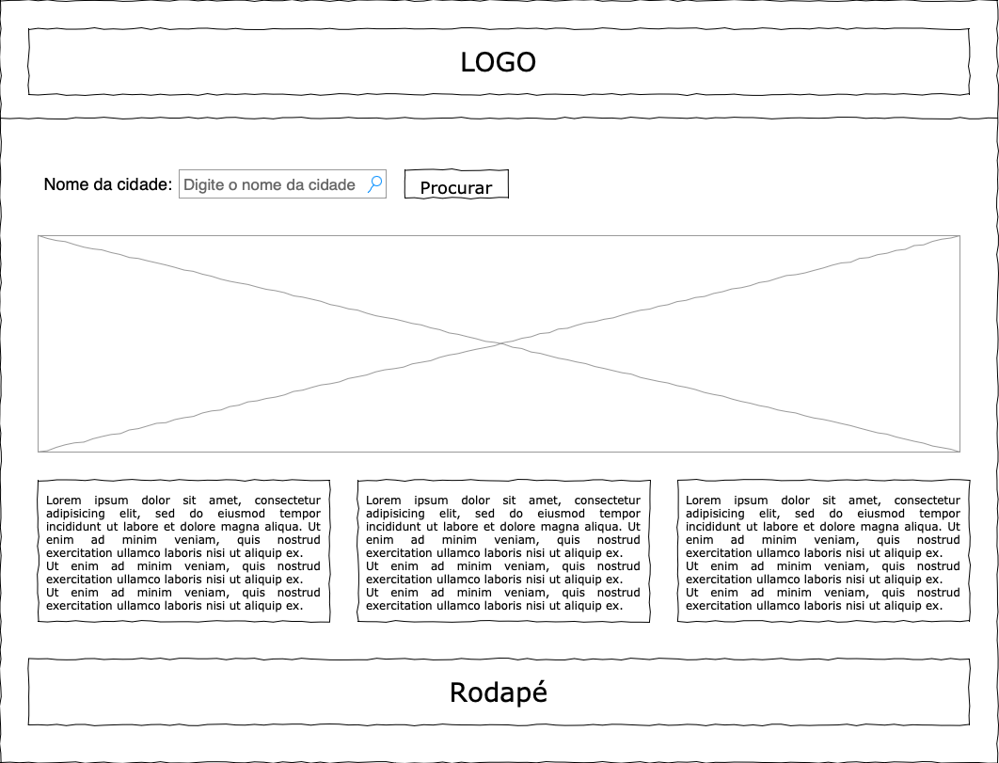

### Front-end Web
## Tecnologias Utilizadas

Tecnologias utilizadas:

Backend (API Web ASP.NET Core):

ASP.NET Core: framework do lado do servidor da Microsoft usado para desenvolver a API.

C#: A linguagem de programação usada para escrever a lógica da aplicação no backend.

Swagger: interface interativa para testar endpoints.

### Frontend (JavaScript, HTML e CSS):

HTML: A linguagem de marcação usada para estruturar o conteúdo da página da web.

CSS (Cascading Style Sheets): Utilizado para estilizar e formatar a aparência da página web.

JavaScript: A linguagem de programação usada para criar interatividade no lado do cliente. 

AJAX: É frequentemente usado para fazer solicitações assíncronas à API para buscar ou enviar dados sem a necessidade de recarregar a página.

## Arquitetura

### Frontend (Cliente Web):

Este é o componente com o qual o usuário interage.
O frontend fornece uma interface de usuário amigável para inserir informações, como o nome da cidade ou coordenadas geográficas, e solicitar dados climáticos.
Ele envia solicitações à API web para buscar os dados climáticos necessários.
O frontend também exibe os dados climáticos de forma legível, podendo ser em tabelas, gráficos ou outros elementos visuais, dependendo dos requisitos do projeto.
Pode oferecer recursos adicionais, como filtros, favoritos, gráficos interativos e recursos de compartilhamento.

### API Web (Backend):

O backend é responsável por processar as solicitações do frontend e acessar os dados climáticos.
Ele se comunica com serviços externos para coletar informações climáticas atualizadas. Neste caso, ele pode se integrar a serviços meteorológicos ou fontes de dados climáticos confiáveis, como APIs de meteorologia.
A API recebe solicitações do frontend, analisa os parâmetros, busca os dados climáticos relevantes da fonte de dados externa e, em seguida, envia os dados de volta para o frontend em um formato adequado (geralmente JSON).
Ela lida com a lógica de negócios, como a validação dos parâmetros de entrada e a formatação dos dados de saída.

### Serviço de Dados Climáticos Externos:

Este componente representa os serviços externos, como APIs de meteorologia ou fontes de dados climáticos em tempo real.
Fornecem informações climáticas detalhadas para cidades brasileiras e estão conectados à API web.
Podem incluir previsões de temperatura, umidade, precipitação, vento e outros parâmetros climáticos.

O usuário insere o nome da cidade ou coordenadas geográficas no frontend.
O frontend envia uma solicitação à API web, incluindo os parâmetros da consulta (cidade, coordenadas, etc.).
A API web valida a solicitação, faz uma chamada aos serviços de dados climáticos externos, obtém os dados climáticos correspondentes e os formata em um formato JSON.
A API web envia a resposta JSON de volta ao frontend.
O frontend exibe os dados climáticos ao usuário.
Essa arquitetura permite uma separação clara entre a interface do usuário (frontend) e a lógica de negócios (API web). Além disso, mantém a flexibilidade para se integrar a diferentes fontes de dados climáticos e escalar conforme necessário para atender a uma crescente demanda de usuários.

## Modelagem da Aplicação

### Estrutura de Dados:
A aplicação web PreviAqua lida com dados meteorológicos. A estrutura de dados principal é um objeto Alerta que contém as informações meteorológicas para uma cidade. As informações incluídas no objeto Alerta são:

- chuva: Probabilidade de chuvas em milímetros.
- umidadeMaxima: Umidade máxima em porcentagem.
- pressao: Pressão atmosférica em milibares.
- resultado: Resultado geral dos dados meteorológicos.

### Diagrama de Classes ou Entidades:
A estrutura de dados mencionada pode ser representada em um diagrama de classes ou entidades da seguinte forma:
| Classe: Alerta                                  |
|-----------------------------------------------|
| Atributos:                                    |
| - chuva: float                                |
| - umidadeMaxima: int                          |
| - pressao: int                                |
| - resultado: string                           |
|                                               |
| Métodos:                                      |
| + getChuva(): float                           |
| + getUmidadeMaxima(): int                     |
| + getPressao(): int                           |
| + getResultado(): string                      |
|-----------------------------------------------|

Neste diagrama, a classe Alerta possui atributos privados representando os dados meteorológicos e métodos públicos para acessar esses atributos.

### Representações Visuais Relevantes:
A aplicação PreviAqua possui uma interface de usuário com elementos HTML, CSS e JavaScript para interação com os usuários e exibição dos dados. Alguns dos elementos visuais relevantes na aplicação são:

- Header: O cabeçalho da página contém o logotipo, o botão de menu, e a barra de navegação.
- Formulário de Busca: O formulário de busca permite aos usuários inserir o nome de uma cidade e pressionar o botão "Procurar" para obter informações meteorológicas.
- Resultados: A seção de resultados exibe as informações meteorológicas, incluindo a probabilidade de chuva, umidade máxima, pressão atmosférica e um resultado geral.
- Previsão do Tempo: A previsão do tempo para os próximos dias é exibida em formato de tabela, com informações como o dia da semana, a data, a cidade, a temperatura, ícones de clima e outras informações relacionadas.
- Notícias: A seção de notícias exibe informações relacionadas ao clima e eventos climáticos em várias regiões.
- Além disso, a aplicação utiliza JavaScript para fazer chamadas à API externa para obter os dados meteorológicos com base na cidade inserida pelo usuário e exibir esses dados na seção de resultados.

## Projeto da Interface Web

### Wireframe

### Design Visual
1. Paleta de Cores:
- Optamos por uma paleta de tons escuros para o front-end para proporcionar uma experiência de usuário agradável e de fácil leitura, especialmente durante a noite.

2. Tipografia:
- A fonte principal usada no corpo do texto é "Roboto" com uma queda para "Open Sans" como uma fonte de fallback. A fonte é legível e possui uma aparência moderna.

3. Botões:
- Os botões na interface têm bordas arredondadas e uma cor de fundo azul (#009ad8) com texto branco para criar um contraste com o fundo escuro e facilitar a encontrabilidade pelo usuário.

### Layout Responsivo
## Adaptação da Interface para Diferentes Tamanhos de Tela e Dispositivos

A adaptação da interface do projeto para diferentes tamanhos de tela e dispositivos é uma parte essencial do desenvolvimento front-end responsivo. Aqui estão algumas maneiras pelas quais a interface será adaptada:

1. **Layout Flexível:** O layout da página será projetado com unidades flexíveis, como porcentagens, em vez de unidades fixas, como pixels. Isso permite que os elementos da página se ajustem dinamicamente ao tamanho da tela, preenchendo o espaço disponível de forma adequada.

2. **Media Queries:** Utilizaremos media queries em nosso CSS para aplicar estilos específicos com base na largura da tela. Isso permite a personalização de estilos, como alterar o tamanho das fontes, reorganizar os elementos na página e ocultar ou exibir certos conteúdos com base na resolução da tela.

3. **Imagens Responsivas:** As imagens serão configuradas para serem responsivas. Isso significa que as imagens se redimensionarão automaticamente para se ajustar ao tamanho da tela, economizando largura de banda e melhorando o desempenho.

4. **Menu de Navegação Adaptável:** Em dispositivos móveis e tablets, podemos substituir o menu de navegação tradicional por um menu de hambúrguer, economizando espaço na tela e tornando a navegação por toque mais fácil.

5. **Fontes Flexíveis:** O tamanho e o estilo das fontes também serão ajustados para garantir que o texto seja legível em diferentes dispositivos. Usaremos unidades relativas, como "em" e "rem", para manter a consistência.

6. **Componentes Interativos:** Elementos interativos, como botões e caixas de entrada, serão dimensionados e espaçados adequadamente para garantir que sejam fáceis de usar em telas sensíveis ao toque e com dispositivos de entrada variados.

7. **Testes em Múltiplos Dispositivos:** A interface será testada em uma variedade de dispositivos e tamanhos de tela, desde smartphones até monitores de alta resolução. Isso ajuda a identificar problemas e garantir que a experiência do usuário seja otimizada em todos os contextos.

Em resumo, a interface do projeto será adaptada para diferentes tamanhos de tela e dispositivos por meio de técnicas de design responsivo, usando CSS flexível, media queries e ajustando todos os elementos para garantir que a aplicação funcione e seja visualmente atraente em qualquer dispositivo, criando assim uma experiência consistente e amigável para todos os usuários.

### Interações do Usuário
O projeto foi meticulosamente desenvolvido com o objetivo de oferecer uma experiência prática e intuitiva, permitindo que pessoas de todas as idades realizem consultas meteorológicas facilmente e compreendam as informações retornadas pelo sistema. Além disso, nosso foco é garantir que a aplicação seja acessível a diversas classes sociais, democratizando o acesso à informação climática.

## Fluxo de Dados
O usuário acessa a página da web e insere o nome da cidade desejada no campo de entrada com o ID "cidade".
Quando o usuário clica no botão "Procurar" com o ID "city," o evento de clique é acionado.
O código JavaScript associado ao evento de clique inicia uma solicitação GET para uma API de alertas climáticos. A URL da API é construída com base no nome da cidade inserido e é definida como URL.
A resposta da API é analisada para obter informações sobre os alertas climáticos para a cidade. Os tipos de alertas incluem probabilidade de chuvas, umidade máxima, pressão atmosférica e um resultado geral.
Os dados obtidos da API são exibidos na página da web. Os alertas climáticos são mostrados na div com o ID "resultado." Cada tipo de alerta é exibido como uma lista, incluindo a probabilidade de chuvas, umidade máxima, pressão atmosférica e um resultado geral.
Se os dados da API estiverem indisponíveis para um determinado tipo de alerta, a mensagem "sem dados disponíveis" é exibida.

## Requisitos Funcionais

[Liste os principais requisitos funcionais da aplicação.]

## Requisitos Não Funcionais

[Liste os principais requisitos não funcionais da aplicação, como desempenho, segurança, escalabilidade, etc.]

## Considerações de Segurança

[Discuta as considerações de segurança relevantes para a aplicação distribuída, como autenticação, autorização, proteção contra ataques, etc.]

## Implantação

1. Defina os requisitos de hardware e software necessários para implantar a aplicação em um ambiente de produção.
2. Escolha uma plataforma de hospedagem adequada, como um provedor de nuvem ou um servidor dedicado.
3. Configure o ambiente de implantação, incluindo a instalação de dependências e configuração de variáveis de ambiente.
4. Faça o deploy da aplicação no ambiente escolhido, seguindo as instruções específicas da plataforma de hospedagem.
5. Realize testes para garantir que a aplicação esteja funcionando corretamente no ambiente de produção.

## Testes

1. Crie casos de teste para cobrir todos os requisitos funcionais e não funcionais da aplicação.
2. Implemente testes unitários para testar unidades individuais de código, como funções e classes.
3. Realize testes de integração para verificar a interação correta entre os componentes da aplicação.
4. Execute testes de carga para avaliar o desempenho da aplicação sob carga significativa.
5. Utilize ferramentas de teste adequadas, como frameworks de teste e ferramentas de automação de teste, para agilizar o processo de teste.

# Referências

Inclua todas as referências (livros, artigos, sites, etc) utilizados no desenvolvimento do trabalho.
